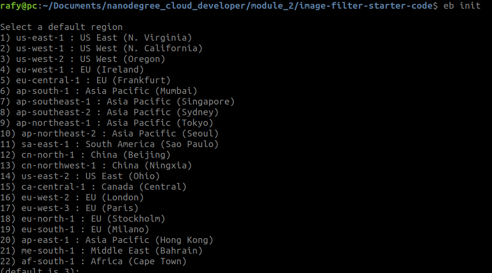
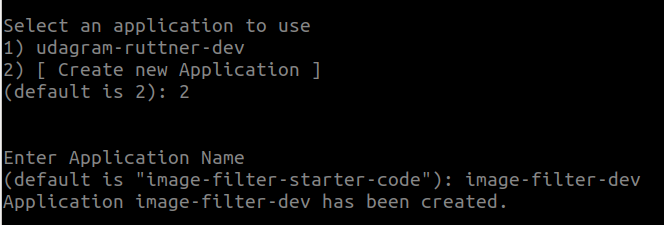
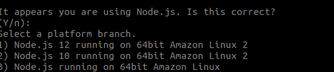
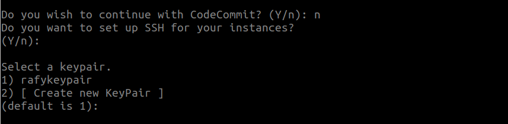
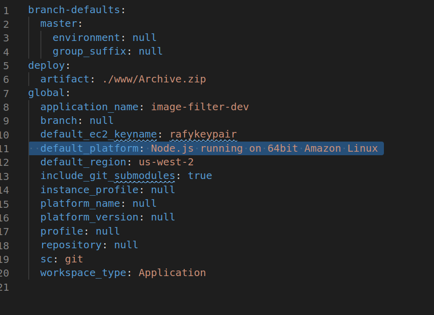
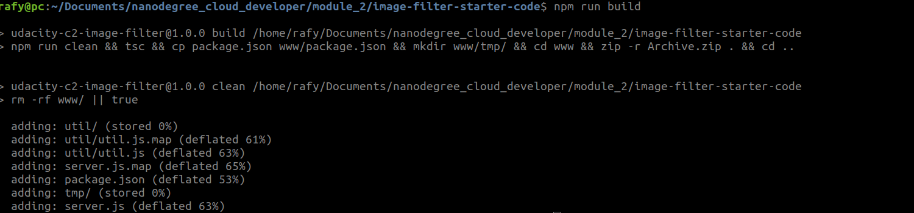
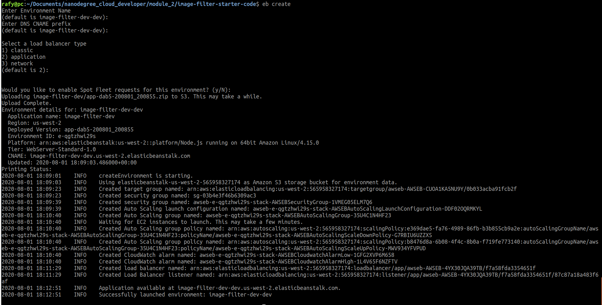
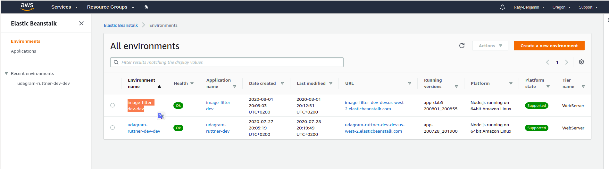

# Udagram Image Filtering Microservice

Udagram is a simple cloud application developed alongside the Udacity Cloud Engineering Nanodegree. It allows users to register and log into a web client, post photos to the feed, and process photos using an image filtering microservice.

The project is split into three parts:
1. [The Simple Frontend](https://github.com/udacity/cloud-developer/tree/master/course-02/exercises/udacity-c2-frontend)
A basic Ionic client web application which consumes the RestAPI Backend. [Covered in the course]
2. [The RestAPI Backend](https://github.com/udacity/cloud-developer/tree/master/course-02/exercises/udacity-c2-restapi), a Node-Express server which can be deployed to a cloud service. [Covered in the course]
3. [The Image Filtering Microservice](https://github.com/udacity/cloud-developer/tree/master/course-02/project/image-filter-starter-code), the final project for the course. It is a Node-Express application which runs a simple script to process images. [Your assignment]

## Tasks

### Setup Node Environment

You'll need to create a new node server. Open a new terminal within the project directory and run:

1. Initialize a new project: `npm i`
2. run the development server with `npm run dev`

### Create a new endpoint in the server.ts file

The starter code has a task for you to complete an endpoint in `./src/server.ts` which uses query parameter to download an image from a public URL, filter the image, and return the result.

We've included a few helper functions to handle some of these concepts and we're importing it for you at the top of the `./src/server.ts`  file.

```typescript
import {filterImageFromURL, deleteLocalFiles} from './util/util';
```

### Deploying your system

Follow the process described in the course to `eb init` a new application and `eb create` a new environment to deploy your image-filter service! Don't forget you can use `eb deploy` to push changes.

#### Project URL
`http://image-filter-dev-dev.us-west-2.elasticbeanstalk.com/`
#### Endpoint URL
`http://image-filter-dev-dev.us-west-2.elasticbeanstalk.com/filteredimage`
###### example
`http://image-filter-dev-dev.us-west-2.elasticbeanstalk.com/filteredimage?image_url=https://www.autotrader.co.uk/used-cars/images/static/value-proposition/VauxhallCorsa@1.5x.png`
#### Deploying steps
##### Config the environment
- Initializes your directory with the EB CLI `eb init`


- Choosing application name


- Select the platform


- select code commit and ssh key pair


- Update the config with deploy artifact to use our Archive.zip directory


##### build the project using `NPM`
- `npm run build` 



##### Creates a new environment
- Creates environment


##### Validate that the project deployed on `Elastic Beanstalk`


##### Testing the endpoint using `Postman`
- Sending image_url param to the endpoint
`http://image-filter-dev-dev.us-west-2.elasticbeanstalk.com/filteredimage?image_url=`
_postman.png)

- Not sending image_url param to the endpoint
_postman.png)